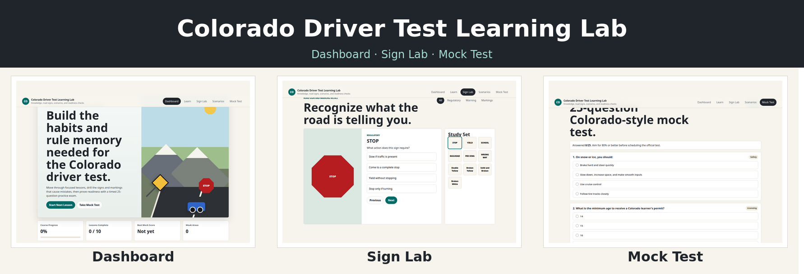

# Colorado Driver Test Learning Lab

An interactive, browser-based study app for the Colorado driver knowledge test.

## AI Disclaimer

This app was nearly one-shot with Codex and GPT-5.5. I wanted a practice tool to prep for my knowledge test and didn't like the online options so decided to cook up my own. I passed the test so I think it works pretty well as a learning aide and was worth sharing. I figured people can still point their agents to this repo for inspiration to generate their own learning tools.

## What It Includes

- Guided lessons for Colorado permits, minor driver rules, traffic laws, signs, markings, right-of-way, defensive driving, and Colorado road conditions
- Personalized permit path planner by age and license status
- Road sign and pavement marking drills
- Scenario-based decision practice
- 25-question mock test with scoring and review feedback
- Local progress saving in the browser
- Official Colorado DMV and CDOT reference links

## Run It

Open `index.html` in a browser.

No build step, server, or dependencies are required.

## Files

- `index.html` - app structure
- `styles.css` - responsive layout and visuals
- `app.js` - lesson content, drills, scenarios, mock test logic, and progress storage

## Notes

This is a study tool, not an official test. Always verify requirements and current rules with the Colorado DMV and CDOT before scheduling or taking the official exam.
